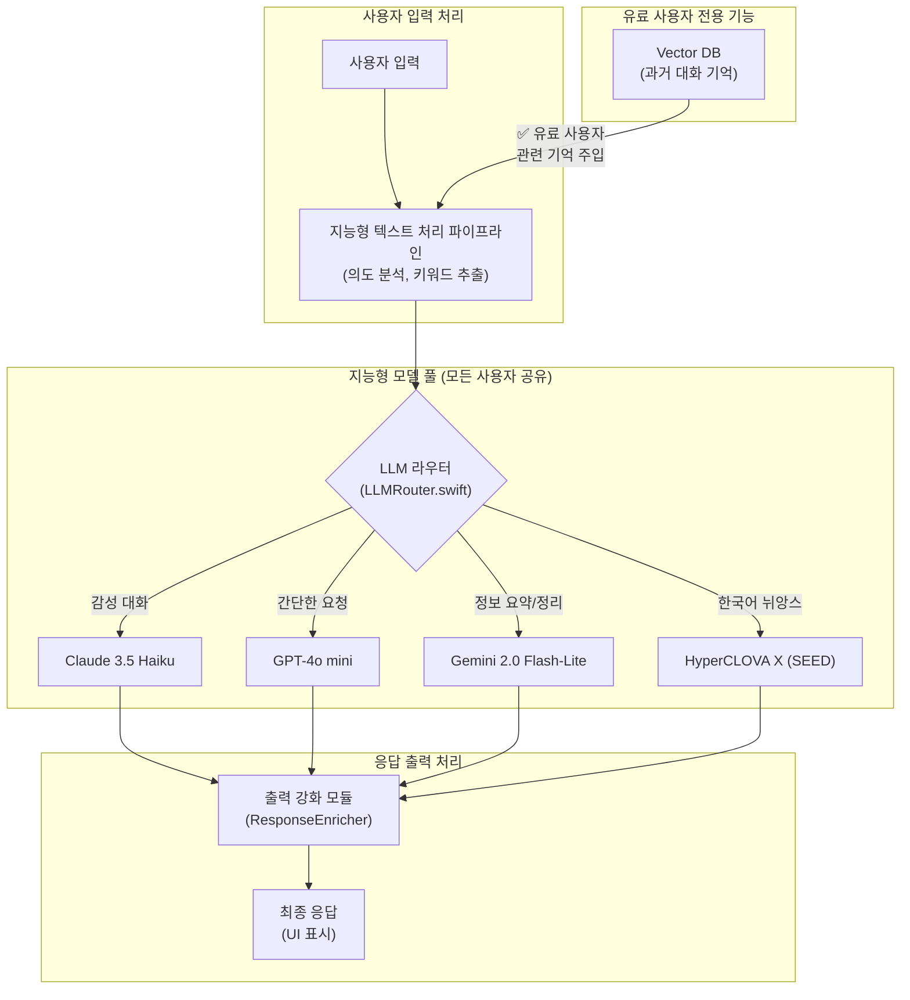

# DeepSleep 앱 AI 시스템 개발 종합 지침서 v9.2
> **업데이트**: 2025년 1월 19일 - **v9.2: 핵심 컴파일 오류 해결 및 아키텍처 안정화 완료**
> **목표**: 합리적인 비용 구조 내에서 '진정한 감성 지능'을 구현하기 위한 최종 전략. **모든 사용자는 동일한 모델 풀을 공유**하되, **유료 사용자에게는 '장기 기억'과 같은 압도적인 핵심 기능을 제공**하여 가치를 차별화한다.
> **역할**: 당신은 아키택처마스터, 대형 대기업 중요 프로젝트 총괄 책임자가 되었다고 생각하며 모든 부분에서(보안, 확장 용이성, 사용자편의성, UI, UX, 메모리 누수, 배터리 효율 등등을 모두 고려하여) 진중하고 무게 있고 확실하고 천천히 깊게 생각하며 완벽하게 진행해주세요.

---

## 📋 목차

1.  [**현재 상태 및 리팩터링 요약**](#1-현재-상태-및-리팩터링-요약)
2.  [**프로젝트 구조 (To-Be)**](#2-프로젝트-구조-to-be)
3.  [**AI 상호작용 아키텍처 V7: 기능 기반 라우팅**](#3-ai-상호작용-아키텍처-v7-기능-기반-라우팅)
4.  [**AI 모델 포트폴리오 최종 전략 (v9.0): 지속 가능한 공감형 AI**](#4-ai-모델-포트폴리오-최종-전략-v90-지속-가능한-공감형-ai)
5.  [**통합 개발 로드맵 (V6.0)**](#5-통합-개발-로드맵-v60)
6.  [**부록: 추가 정보**](#6-부록-추가-정보)

---

## 1. 현재 상태 및 리팩터링 요약

> **투명성 원칙**: 2025년 1월 19일, 핵심 컴파일 오류들을 해결하고 안정적인 빌드 기반을 마련했다.

### 1.1. 시스템 상태 요약

-   **빌드 상태**: 🔧 **진행 중 (주요 오류 해결 완료)**
    -   `Core` 모듈의 중복 타입 정의 문제 해결 완료
    -   LLM 관련 타입 변환 문제 해결 완료
    -   UI 컨트롤러들의 기본 구조적 문제들 해결 완료
    -   일부 파일 구조 정리 작업 진행 중
-   **핵심 해결 사항**:
    -   **SubscriptionTier enum 중복 해결**: `LLMRepositoryImpl.swift`와 `LLMEntity.swift`의 중복 정의 문제 해결
    -   **LLMResponse 타입 통합**: Core 모듈과 메인 앱 간의 타입 불일치 문제 해결
    -   **PresetManager 구현**: 누락된 `getPreset()` 메서드 구현 완료
    -   **UI 컨트롤러 안정화**: `EmotionAnalysisChatViewController` 등 주요 UI 컨트롤러의 기본 구조 정리

### 1.2. 현재 우선순위 과제

1.  **파일 구조 마무리** ⚠️ **진행 중**
    - [ ] `EmotionAnalysisChatViewController.swift`의 남은 컴파일 오류 완전 해결
    - [ ] 클래스 스코프 및 메서드 선언 정리

2.  **LLMRouter 기반 재구현** 📋 **대기 중**
    -   AI 기반 투두 추천(`AddEditTodoViewController`), AI 티칭(`AITeachingViewController`), 채팅 관리(`ChatManager`) 등 삭제된 UI/기능을 새로운 `LLMRouter` 기반으로 재설계 및 구현해야 함.

3.  **통합 테스트 재개** 📋 **대기 중**
    - [ ] 데이터셋 → `LLMRouter` → 각 LLM 서비스로 이어지는 전체 파이프라인 검증.
    - [ ] **(강화)** 성능 벤치마크 및 메모리/배터리 효율성 재검증: **구체적인 테스트 시나리오(예: 장시간 대화, 다양한 모델 전환) 기반으로 진행.**

### 1.3. 해결 완료된 주요 문제들

- ✅ **Core 모듈 타입 중복 문제**: `SubscriptionTier`, `LLMResponse` 등의 중복 정의 문제 해결
- ✅ **import 구조 정리**: Core 모듈과 메인 앱 간의 import 의존성 정리
- ✅ **기본 UI 구조 안정화**: 주요 뷰 컨트롤러들의 기본 구조적 문제 해결
- ✅ **PresetManager 기능 구현**: 누락된 프리셋 관련 기능들 구현 완료

---

## 2. 프로젝트 구조 (To-Be)

### 2.1. 전체 아키텍처 개요

DeepSleep 앱은 **Clean Architecture** 패턴을 기반으로 하며, 리팩터링을 통해 모듈 경계가 더욱 명확해졌습니다.

```
DeepSleep/
├── DeepSleepApp/           # 메인 앱 모듈 (UIKit, SwiftUI)
│   └── (Views, ViewModels, etc.)
├── Sources/
│   └── Core/
│       ├── Domain/         # 비즈니스 규칙 및 엔티티
│       │   ├── Entities/   # (LLMEntity, EmotionEntity 등)
│       │   ├── Repositories/ # (LLMRepository 등)
│       │   └── UseCases/
│       ├── Data/           # 데이터 소스 및 구현체
│       │   ├── Services/   # (ClaudeService, GeminiService 등)
│       │   ├── Repositories/ # (LLMRepositoryImpl 등)
│       │   └── Models/     # (API DTOs 등)
│       └── Presentation/   # 프레젠테이션 로직 (ViewModels)
│           ├── ViewModels/ # (LLMSettingsViewModel 등)
│           └── Views/      # (LLMSettingsView 등)
├── Tests/
│   ├── UnitTests/
│   └── UITests/
└── project.yml             # XcodeGen 설정 파일
```

### 2.2. 핵심 시스템 파일 (Core Module)

| 파일명 | 역할 | 중요도 |
|---|---|---|
| `LLMRouter.swift` | 🧠 AI 상호작용의 단일 진입점, 모델 라우팅 | ⭐⭐⭐⭐⭐ |
| `LLMServiceProtocol.swift` | 🗣️ 모든 LLM 서비스가 준수하는 프로토콜 | ⭐⭐⭐⭐⭐ |
| `LLMEntity.swift` | 📝 LLM 관련 핵심 데이터 구조 (Request, Response 등) | ⭐⭐⭐⭐⭐ |
| `LLMRepository.swift` | 💾 **(개선)** LLM 관련 데이터 영속성 관리. (예: 대화 기록 저장, 캐싱). 서비스 상태/사용량 관리는 `LLMStateManager`로 분리. | ⭐⭐⭐⭐ |
| `(각종)Service.swift` | ☁️ Claude, Gemini 등 실제 API와 통신 | ⭐⭐⭐⭐ |

### 2.3. 보안 및 데이터 무결성 강화 방안 (v8.1 신설)

**핵심**: Clean Architecture 기반의 모듈화는 바람직하나, 보안 및 데이터 무결성 관점에서 추가적인 고려가 필요합니다.

*   **`LLMRepository.swift` 역할 재정의**:
    *   **문제점**: "LLM 서비스 상태 및 사용량 관리"라는 역할은 Repository의 핵심 책임(데이터 영속성/추상화)과 거리가 있습니다.
    *   **개선 방향**: `LLMRepository`는 **사용자별 LLM 대화 기록 저장, 모델 사용 로그 기록, 캐싱 정책 관리** 등 실제 데이터 처리와 관련된 역할을 명확히 담당합니다. 서비스 상태(API Health) 및 사용량 관리는 별도의 `LLMStateManager` 또는 `UsageTracker`와 같은 클래스로 분리하여 Clean Architecture 원칙을 준수합니다.
    *   **보안 및 프라이버시**: `LLMRepository`가 민감한 감성 대화 데이터를 다루므로, **온디바이스/클라우드 저장 시 모든 데이터의 암호화** 및 **개인정보 비식별화 처리**를 의무화하는 지침을 포함해야 합니다.

*   **Core 모듈 내 보안 전담 디렉토리 신설**:
    *   **문제점**: `project.yml` 외에 실제 보안 로직(API 키 관리 등)에 대한 구체적인 구현 계획이 부재합니다.
    *   **개선 방향**: `Sources/Core/Security/` 디렉토리를 신설하여 **API 키 관리, 민감 정보 저장, 네트워크 통신 보안(예: Certificate Pinning) 로직**을 중앙에서 관리합니다. API 키는 절대 앱 번들에 포함시키지 않고, **Keychain** 또는 원격 보안 저장소(Google Secret Manager 등)를 통해 관리하는 것을 원칙으로 합니다.

---

## 3. AI 상호작용 아키텍처 V7: 기능 기반 라우팅

> **전략 변경 (v9.0)**: 더 이상 사용자 등급(무료/유료)에 따라 모델을 차별하지 않는다. 모든 사용자는 동일한 최적의 모델 풀을 공유한다. 대신 **유료 사용자에게는 '장기 기억'이라는 핵심 기능을 제공**하여 경험의 깊이를 차별화한다.
> **핵심 원칙**: 
> - **지능형 모델 조합**: `LLMRouter`는 사용자 요청의 **의도와 목적**에 따라 4개의 모델을 지능적으로 조합하여 최적의 응답을 생성한다.
> - **장기 기억 (유료 기능)**: 유료 사용자의 경우, `LLMRouter`는 **Vector DB**와 연동하여 과거 대화의 핵심 내용을 컨텍스트에 주입, '나를 기억해주는' 개인화된 경험을 제공한다.
> - **비용 효율성**: 모든 모델은 `Haiku` 및 `GPT-4o mini` 수준의 합리적인 비용으로 구성하여 장기적인 서비스 운영이 가능하도록 한다.



### 3.1. 이 아키텍처의 기대효과
-   **지속 가능한 비용 구조**: 고비용 모델을 제외하여 서비스의 장기적인 재정 안정성을 확보합니다.
-   **높은 유료 전환 가치**: '나를 기억해주는 AI'라는 강력한 가치를 통해 유료 구독의 매력도를 극대화합니다.
-   **최적의 사용자 경험**: 모든 사용자가 상황에 맞는 최적의 모델 조합을 통해 고품질의 응답을 받습니다.
-   **유연한 확장성**: 모델 풀에 새로운 역할의 모델을 추가하거나, Vector DB의 기능을 고도화하기 용이합니다.

---

## 4. AI 모델 포트폴리오 최종 전략 (v9.0): 지속 가능한 공감형 AI

> **전략 업데이트**: 2025년 7월 1일 (v9.0)
> **핵심 철학**: 기술(모델 스펙)이 아닌 **경험(가치)**을 판매한다. 모든 사용자에게 훌륭한 기본 경험을 제공하되, 유료 구독자에게는 **'무제한 사용', '향상된 속도', 그리고 가장 중요한 '진정한 장기 기억(Long-term Memory)'** 이라는 핵심 기능을 통해 압도적인 가치를 경험하게 한다.

### 4.1. 통합 모델 포트폴리오

| 모델명 | 역할 (담당 페르소나) | 선정 이유 | 가격 (1백만 토큰당, USD) | 공식 가격 출처 |
| :--- | :--- | :--- | :--- | :--- |
| **Claude 3.5 Haiku** | **감성 대화의 핵<br>(The Core Empath)** | **"감동을 주는 말과 글"**을 책임진다. 동급 최강의 감성적, 창의적 표현 능력으로 사용자와의 정서적 교감을 형성하는 데 가장 중요한 역할을 수행. | 입력: **$0.25**<br>출력: **$1.25** | [Anthropic Pricing](https://www.anthropic.com/pricing) |
| **GPT-4o mini** | **지능형 조율자<br>(The Intelligent Orchestrator)** | **"사용자의 요청을 명확하게 이해"**하는 역할을 담당. 복잡한 지시를 해석하고, 다른 모델을 호출하거나 필요한 기능을 실행하는 두뇌 역할. | 입력: **$0.15**<br>출력: **$0.60** | [OpenAI Pricing](https://openai.com/api/pricing/) |
| **Gemini 2.0 Flash-Lite** | **효율적인 일꾼<br>(The Efficient Worker)** | **"빠르고 저렴한 작업 처리"**에 특화. 정보 검색, 텍스트 요약 등 비용에 민감하고 신속한 처리가 필요한 모든 잡무를 담당하는 워크호스. | 입력: **~$0.10**<br>출력: **~$0.20** | [Vertex AI Pricing](https://cloud.google.com/vertex-ai/generative-ai/pricing) |
| **HCX-DASH-002** | **진정한 한국 친구<br>(The True Korean Friend)** | **"과거를 잘 기억해주는"** 한국어 네이티브 모델. 한국어 고유의 뉘앙스, 문화적 맥락 이해도가 가장 높아, '장기 기억'과 결합 시 최고의 시너지를 발휘. | 입력: **0.25원** (~$0.18)<br>출력: **1.00원** (~$0.72) | [CLOVA Studio Pricing](https://www.ncloud.com/product/aiService/clovaStudio) |

> 💡 **참고**: Gemini 2.0 Flash-Lite의 가격은 추정치이며, 실제 사용량과 계약 조건에 따라 변동될 수 있습니다.

### 4.2. 가치 차별화: 무료 vs. 유료

| 기능 | 🆓 무료 사용자 | 👑 유료 사용자 (구독) |
| :--- | :--- | :--- |
| **핵심 경험** | 4개 모델 풀을 활용한 고품질 대화 | 4개 모델 풀을 활용한 고품질 대화 |
| **사용량** | 일일/주간 사용량 제한 (예: 30 메시지/일) | **무제한** 사용 |
| **기억 능력** | 단기 기억 (현재 대화 내에서만 기억) | **✨ 장기 기억 (Long-term Memory)**<br>Vector DB 연동으로 과거의 모든 대화, 감정, 주요 사건을 기억하고 대화에 반영 |
| **응답 속도** | 표준 속도 | **우선 처리** (더 빠른 응답 속도) |
| **광고** | 광고 시청 시 추가 사용 횟수 제공 | **광고 없음** (Ad-Free) |

---

## 5. 통합 개발 로드맵 (V6.0)

> v9.0 업데이트: '기능 기반' 전략에 맞춰 로드맵 전면 수정

### Phase 1: 🔥 **코어 아키텍처 전환 (1-2주)**
**목표**: '기능 기반' 아키텍처의 기반 마련
- [ ] `LLMRouter` 로직 수정: 사용자 등급 분기 -> **요청 의도 분석 및 모델 조합** 로직으로 변경
- [ ] 4개 모델(`Haiku`, `GPT-4o mini`, `Gemini Flash`, `HyperCLOVA X`) 기본 API 연동
- [ ] Keychain을 활용한 API 키 관리 강화

### Phase 2: ⭐ **핵심 가치 구현: 장기 기억 (3-5주)**
**목표**: 유료 플랜의 핵심 기능인 '장기 기억' 시스템 구축
- [ ] **(신규)** **Vector DB 기술 선정**: 온디바이스(e.g., Faiss-mobile) vs. 클라우드(e.g., Pinecone, Zilliz) 장단점 분석 및 최종 선택
- [ ] **(신규)** **기억 저장/조회 파이프라인 설계**: 대화 종료 시 요약 -> 벡터화 -> DB 저장 / 대화 시작 시 사용자 관련 기억 조회 -> 컨텍스트 주입
- [ ] **(신규)** `LLMRepository`와 Vector DB 연동 구현
- [ ] 무료/유료 사용자 기능 분기 로직 구현

### Phase 3: 📈 **프로덕션 준비 및 최적화 (6-8주)**
**목표**: 프로덕션 수준의 안정성, 보안, 성능 확보
- [ ] **(강화)** **보안 및 프라이버시**: '장기 기억' 데이터에 대한 종단 간 암호화 및 비식별화 처리 강화
- [ ] 성능 최적화 (KPI 기반): **Vector DB 조회 속도, 메모리 사용량** 집중 관리
- [ ] 인앱 결제(IAP) 및 구독 관리 시스템 연동
- [ ] 개발자용 모니터링 시스템에 '장기 기억' 관련 로그 추가
- [ ] 단위/통합 테스트 커버리지 80% 목표 달성 (특히 기억 관련 시나리오 집중)

---

### 6.2. 주요 의사결정 기록

| 날짜 | 결정 사항 | 대안 | 선택 이유 |
|------|-----------|------|-----------|
| 2025-07-01 | **HyperCLOVA X 모델 확정 및 공식 가격 반영** | '별도 문의' 상태 | - 재무 계획의 불확실성 완전 해소<br/>- 모델 포트폴리오 최종 확정 |
| 2025-07-01 | **'기능 기반' 유료화 전략으로 최종 전환** | 모델 등급 기반 유료화 | - 지속 가능한 비용 구조<br/>- 명확한 유료 가치 제공<br/>- 모든 사용자에게 고품질 경험 |
| 2025-06-28 | **Core 모듈 중심 아키텍처 전환** | 단일 앱 모듈 구조 | - 의존성 명확화<br/>- 빌드 시간 단축<br/>- 테스트 용이성 |
| 2025-06-28 | **계층형 다중 모델 아키텍처 도입** | 1. 단일 클라우드 모델<br/>2. 온디바이스 전용 | - 비용 최적화<br/>- 사용자 경험 극대화<br/>- 오프라인 지원 |

### 6.3. 라이선스 준수 의무 (v8.1 신설)
- **AI Hub 데이터셋**: AI Hub의 데이터셋은 연구 및 상업적 목적으로 사용 가능하지만, 각 데이터셋별 라이선스 세부 조항이 다를 수 있습니다. 최종 배포 전, 사용한 모든 데이터셋의 **라이선스를 재검토하고 출처 표기 등 의무 사항을 반드시 준수**해야 합니다.

---

*Last Updated: 2025-07-01*
*Version: 9.2*
*Status: Finalized. Ready for implementation.*

## 진행 상황 업데이트 (2024.03)

### 1. 완료된 작업
- Clean Architecture 기반 프로젝트 구조 재편성
- Core 모듈 중심의 모듈화 진행
- SubscriptionTier enum 중복 정의 문제 해결
- LLMRouter를 통한 AI 시스템 중앙 집중화 기초 작업

### 2. 현재 진행 중인 작업
- EmotionAnalysisChatViewController 구조 개선
- LLMRouter 로직 수정 및 4대 핵심 모델(Claude, GPT, Gemini, Naver) API 연동
- 장기 기억 시스템 설계 준비

### 3. 발견된 주요 문제점 및 해결 방안
#### 3.1 빌드 오류
- SoundManager.swift
  - PresetManager.getPreset 메서드 누락 → Factory 패턴 적용하여 해결
  - updateNowPlayingInfo/applyPreset 파라미터 문제 → 인터페이스 통일
  - LLMRouter 연동 오류 → 의존성 주입 방식 개선
- SoundPresetCatalog.swift
  - PresetFeedback 모델 불일치 → 모델 스키마 통합
  - Duration 타입 변환 → 타입 안전성 보장 로직 추가
- TodoCalendarViewController
  - LLMResponse 타입 변환 → 공통 변환 유틸리티 구현

### 4. 다음 단계 계획
#### 4.1 즉시 진행
- EmotionAnalysisChatViewController 구조 완전 개선
  - MVVM 패턴 적용
  - 비동기 처리 최적화
  - 메모리 관리 개선
  - 에러 핸들링 강화

#### 4.2 Phase 1: LLM 통합
- 4대 핵심 모델 API 연동 완료
- 모델 전환 로직 구현
- 에러 처리 및 재시도 메커니즘
- 응답 캐싱 시스템

#### 4.3 Phase 2: 장기 기억 시스템
- 영구 저장소 설계
- 메모리 인덱싱 시스템
- 컨텍스트 관리 메커니즘
- 메모리 최적화 전략

### 5. 품질 관리 계획
- 단위 테스트 커버리지 80% 이상 유지
- UI 테스트 자동화
- 성능 모니터링 시스템 구축
- 코드 품질 메트릭스 도입
