## 🔑 API 토큰 설정

```bash
export REPLICATE_API_TOKEN=r8_관리자에게_문의하세요
./generate-secrets.sh                  # Secrets.xcconfig 자동 생성

🌙 EmoZleep (DeepSleep) — AI 기반 감정 맞춤형 사운드 수면 앱

AI와 함께하는 개인 맞춤형 수면 사운드 경험
당신의 감정·건강 데이터를 분석해 최적의 수면 환경을 제공합니다.


⸻

📱 프로젝트 개요

EmoZleep은 사용자의 감정 상태와 건강 데이터를 AI로 분석해 맞춤형 수면 사운드를 제공하는 iOS 앱입니다.
단순 Sleep-Timer 를 넘어, 감정 일기·캘린더·AI 코칭까지 아우르는 ‘종합 웰니스 플랫폼’을 목표로 합니다.

⸻

✨ 주요 기능

🎵 스마트 사운드 시스템
    •    13가지 고품질 자연 사운드(🌊 파도, 🌧️ 비, 🔥 벽난로 …)

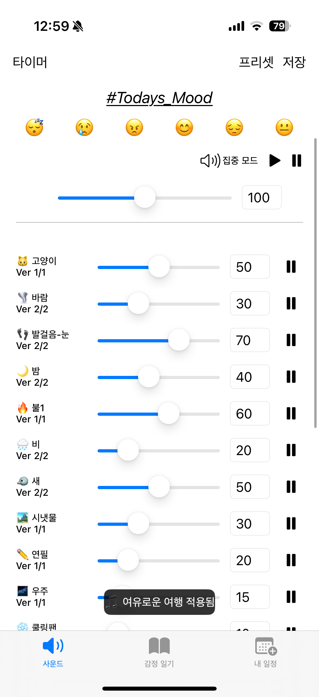

    •    여러 사운드를 실시간 믹싱·프리셋 저장
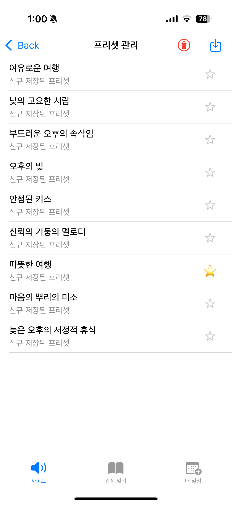
    •    백그라운드 오디오 & 제어 센터 통합(집중 모드, 혼합 모드)
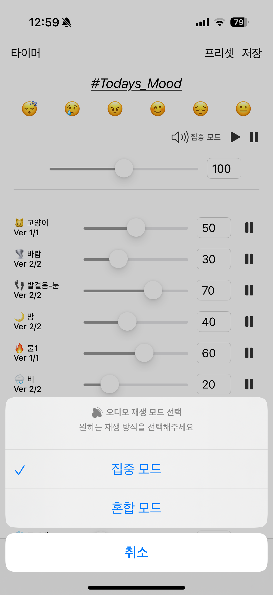
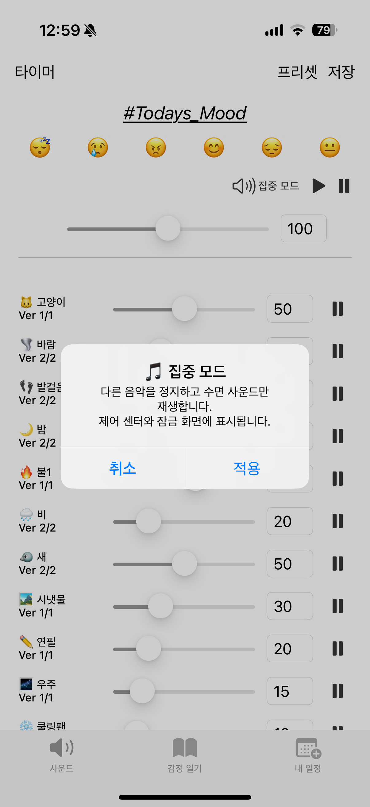
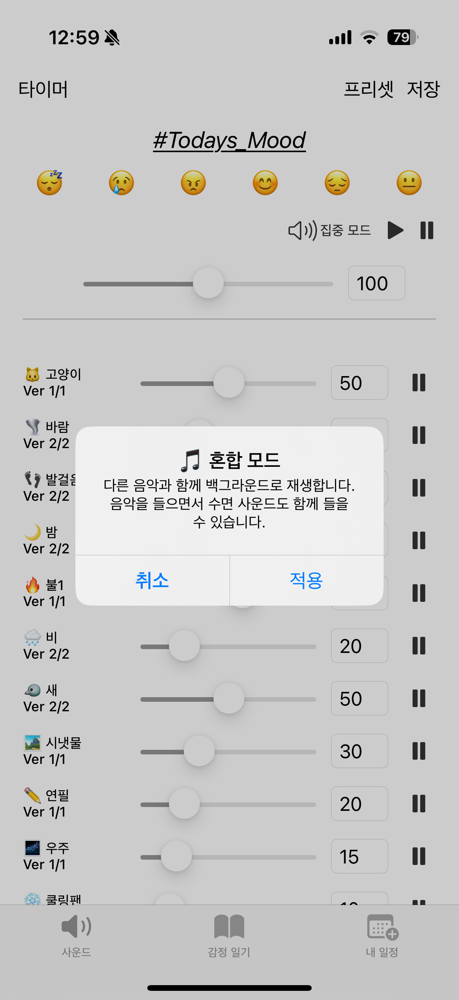

🤖 AI 기반 개인화
    •    Claude 3.5 Haiku(Replicate API) 통합
    •    감정 분석 → 최적 사운드 프리셋 추천
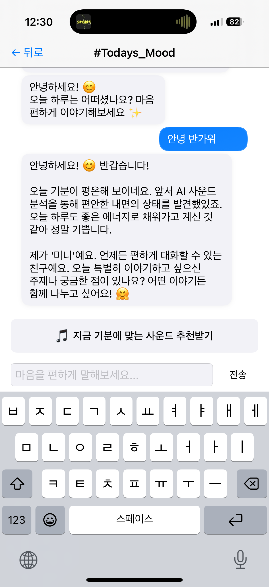

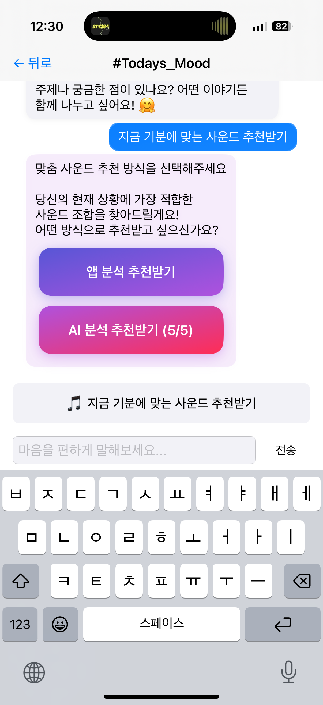

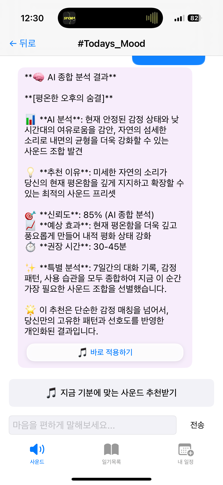

🧠 로컬 기반 추천
    •	실시간 분석: 다양한 사용자 데이터를 디바이스 내 신경망으로 실시간 분석
    •	다차원 통합: 일기·채팅·행동·환경·시간대·감정 등 다차원 데이터 통합
    •	최적 사운드 추천: 각 분석 모듈 결과를 종합해 가장 적합한 사운드 추천
    •	최신 AI 기법 적용: MoE·LoRA·Quantization·Few-Shot·Meta-Learning 등 적용
    •	오프라인 처리: 모든 분석/추천이 디바이스 내에서 빠르고 안전하게 실행
    •	자동 학습·적응: 행동 기록 및 실시간 패턴 분석으로 자동 맞춤 최적화
    •	UI 자연 연동: UI와 부드럽게 연동되어 풍부한 인사이트와 추천 제공
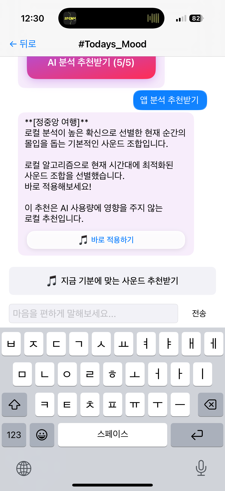

📖 감정 일기 & 분석
    •    감정 기록 + AI 대화

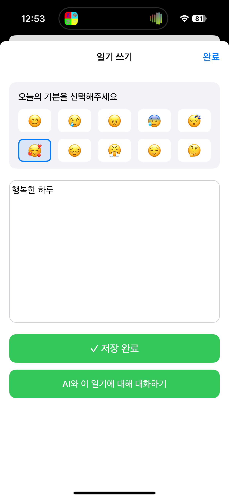

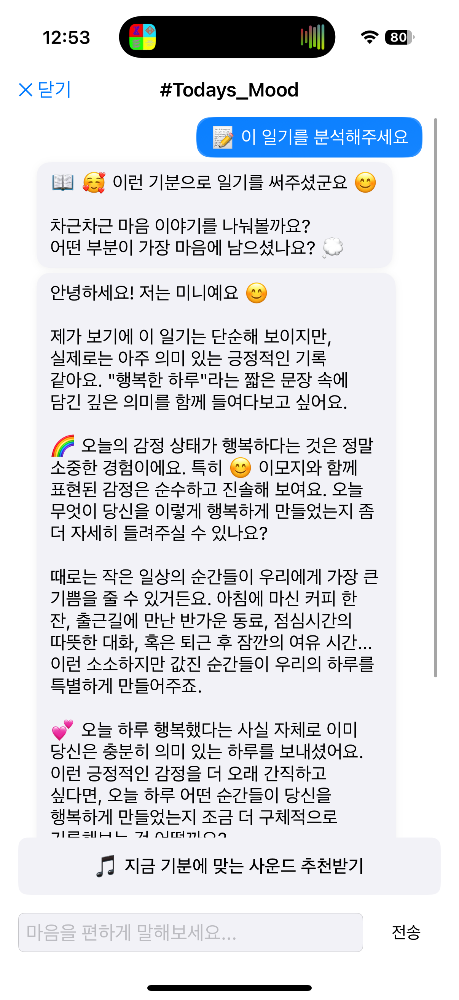

    •    패턴 분석 & 인사이트

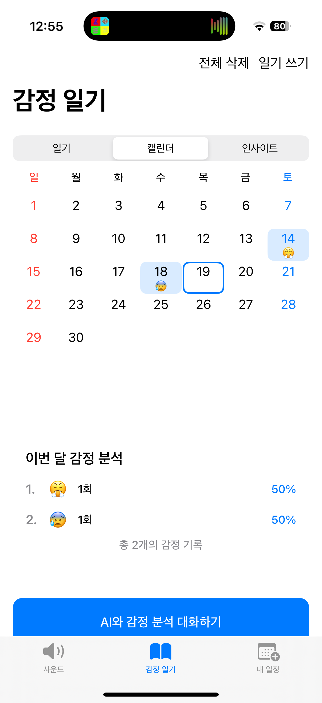

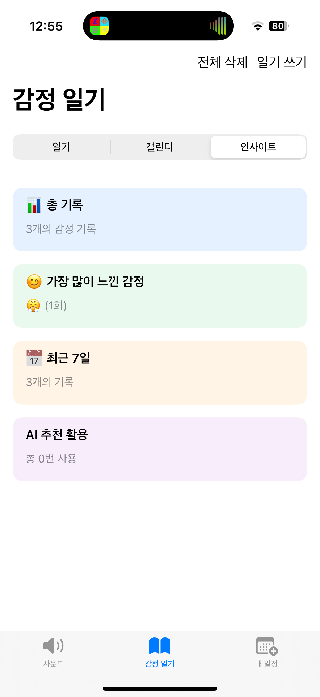


📅 스마트 일정 관리
    •    감정과 연계된 할 일 관리
    •    iOS 캘린더 동기화 + 스마트 알림
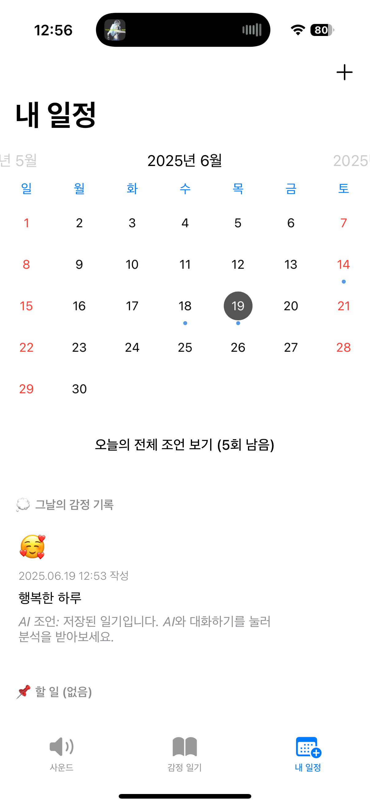
🔗 소셜 기능
    •    프리셋 QR/URL 공유

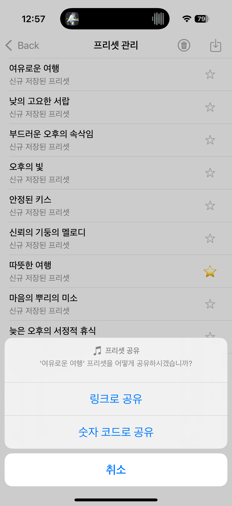
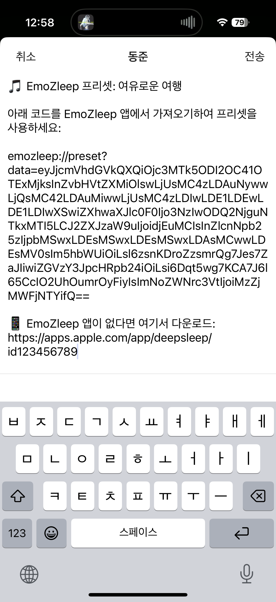
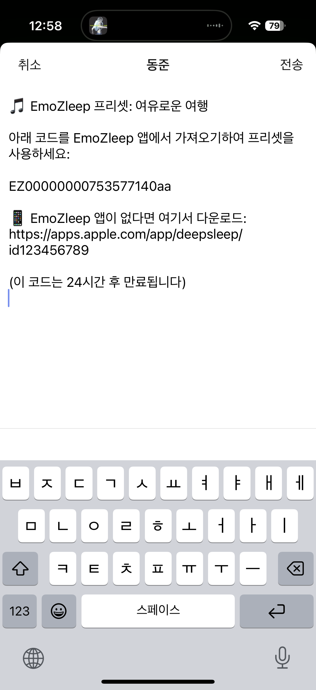
⸻

🏗 기술 아키텍처

프론트엔드

Swift + UIKit
├─ MVC 기반 구조
├─ Auto Layout 반응형 UI (다크모드 완전 대응)
└─ URL Scheme / 딥링크

AI & 외부 서비스

Replicate API  (Claude 3.5 Haiku)
├─ 실시간 AI 대화
├─ 감정 분석 · 추천
└─ 토큰 사용량 최적화 

데이터 관리

UserDefaults + CoreData
├─ 프리셋 버전 관리
├─ 감정 일기 영구 저장
└─ 캐시 & 백업 / 복원

오디오 시스템

AVFoundation
├─ 싱글톤 AVAudioEngine 믹서
├─ 다중 트랙 실시간 믹싱
└─ 배터리 효율 최적화

⸻

🚀 설치 & 실행
    1.    클론

git clone https://github.com/dj20014920/DeepSleep.git
cd DeepSleep


    2.    API 키 설정

echo "REPLICATE_API_TOKEN = YOUR_API_KEY" > DeepSleep/Secrets.xcconfig


    3.    빌드

open DeepSleep.xcodeproj   # ⌘R 로 실행


⸻

📚 사용 방법
    1.    사운드 믹싱 — 13개 카테고리 볼륨을 조정해 나만의 조합 저장
    2.    감정 일기 — AI와 대화하며 감정 기록·분석 → 프리셋 자동 추천
    3.    일정 관리 — 할 일 등록 시 AI 조언, 캘린더와 자동 동기화
    4.    AI와 대화 - 외부 AI와 대화하며 감정 케어

⸻


<div align="center">


🌙 EmoZleep와 함께 더 나은 수면을 경험하세요!

⭐ Star • 🐛 Bug • 💡 Feature

</div>
```

